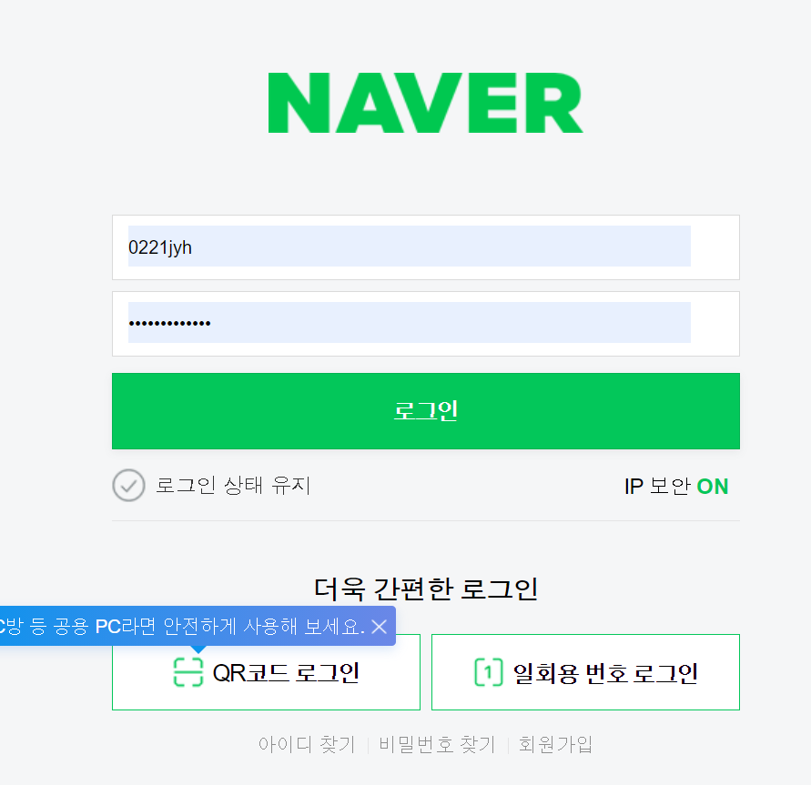
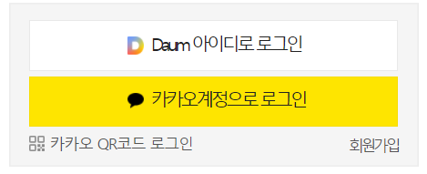
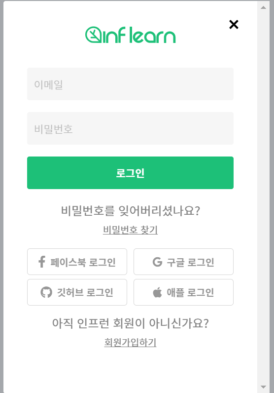
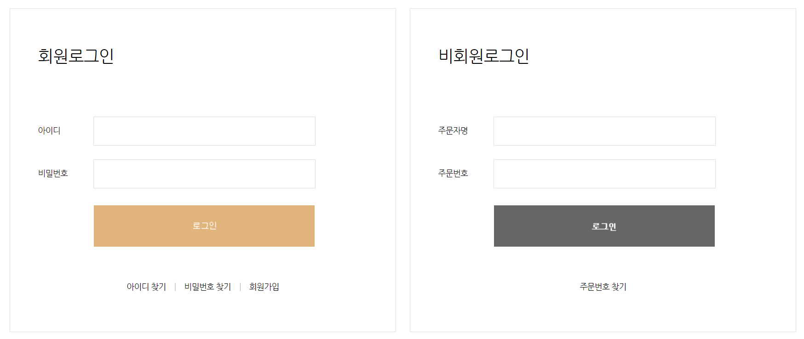
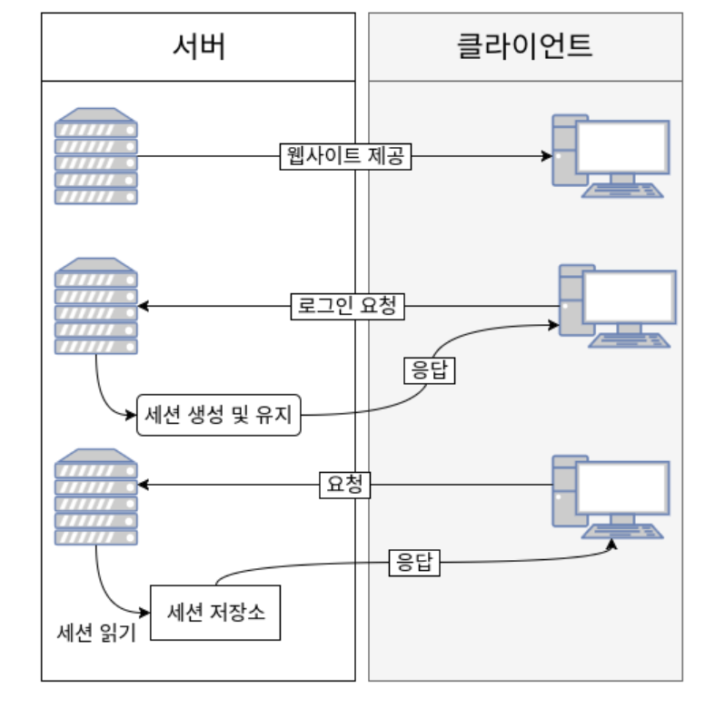
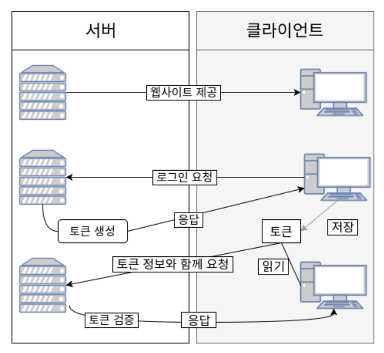

# Login 사전조사 

## 1.개요
모바일 청첩장의 Login 기능을 만들기 위해 어떠한 로그인 방식이 있고 어떠한 보안 및 기술을 사용해서 구현 할 것인지 조사한다. 

## 2.로그인 창 컨텐츠 조사  
이번 장의 로그인방식은 다른 사이트를 확인 하여 로그인 기술을 확인해 본다.

### 2-1.naver 
naver 웹사이트에서는 QR 코드 로그인, 일회용번호 로그인, 로그인 상태유지, 아이디 찾기, 비밀번호찾기, 회원 가입 등이 있다. 

### 2-2.daum 
daum 은 카카오 계정으로 로그인 Daum 아이디로 로그인으로 나누어져 있으며 QR코드로 로그인도 존재하고 있었다.

### 2-3.inflearn 
인프런 사이트에서는 페이스북로그인, 구글로그인, 깃허브로그인, 애플로그인 등이 있었으며 여기서 눈에 띄는것은 애플로그인 이었던 것 같다. 

### 2-4. 청첩장 사이트 (it`s card)
실제 청첩장 쇼핑몰에서는 회원 로그인 비회원 로그인으로 나누어져 있었다. 

### 2-5. 정리
여기에서 기본적으로 아이디 찾기 | 비밀번호 찾기 | 회원가입이라는 기능들이 파생 될 듯 하다. 이런 기술적 메커니즘과 화면 설계 들은 이슈사항으로 남겨놓고 추후 조사해 취합하기로 한다. 

QR코드 로그인 같은 부분은 기능 도입을 고려해본다. (시간상 개발 후순위) 

대한민국 국민이 ID를 제일 많이 가지고 있는 3개의 포털사잍 Naver 아이디로 로그인, Kakao Id로 로그인 , Google Id로 로그인을 구현해본다.

추가로 github Id로 로그인을 검토하여 도입할 수 있으면 도입한다. 

자동로그인 기능을 도입할 수 있을지 확인한다. 

## 3.인증방식의 조사 
인증방식을 어떠한 방식으로 할 것인지를 조사한다. 

1. 서버기반 인증 
로그인시 DB 나 세션 같은 서버사이드 측에 저장하여 로그인 상태를 유지한다.  
소규모 프로젝트에서는 아주 좋은 방법의 인증 체계 이며 흐름은 다음과 같다. 

2. 토큰방식 인증
토큰기반의 인증 시스템은 인증받은 사용자들에게 토큰을 발행하고, 서버에 요청을 할 때에 해더에 토큰을 함께 보내도록 하여 유효성 검사를 한다. 상태를 유지하지 않으므로 stateless한 구조를 갖는다. 

## 4.정리
이번에 조사한 자료로 인증방식을 선택 후 세세한 인증 방식 토큰방식으로 선택하였으면 JWT 방식으로 한다던가의 방향성을 논의후 결정한다. 

또한 암호화 방식은 어떠한 걸로 결정할 것인지 정하고 차주에 Login에 필요한 기술 요소들을 결정 후 로그인/회원에 필요한 entity 를 확인한 후 DB설계까지가 1차 목표로 한다. DB설계를 하는 도중 UI/UX 설계를 한후 UI 를 Mockup 형태로 개발해본다. 

이쁜 디자인이 안나오더라도 기능 구현은 8주 안에 마무리 짓는것을 목표로한다. (회원가입/ 비밀번호찾기/ 로그인/ 아이디 찾기)

중간 6주차 이후 1차 결과물을 내야하며 회고의 시간을 갖는다.

## 99.Todo 목록 
- 아이디찾기 
- 비밀번호 찾기
- 회원가입

