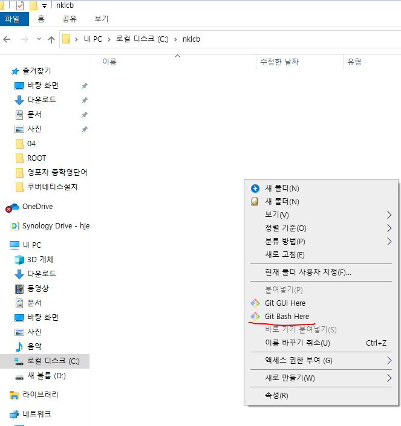
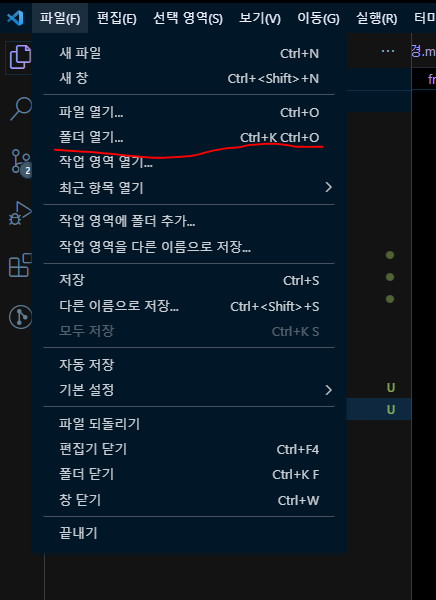
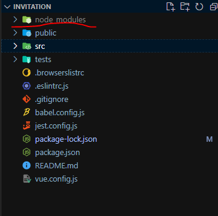
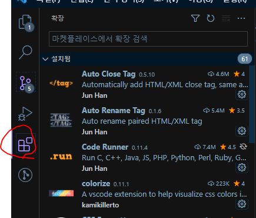

# 01. Backend 개발환경설정

## 1. 기본 툴 설치 
- Node.js V.14
- VSCode
- Git
- DBeaver 

위의 항목을 설치한다. 

> [설치방법 링크 클릭](https://github.com/manbalboy/nklcb-project-invitation/blob/master/doc/common/00.%EA%B0%9C%EB%B0%9C%ED%99%98%EA%B2%BD.md)

## 2. 소스 다운로드
1) C:\nklcb 경로에 폴더를 만든다.
2) 마우스우클릭을 클릭하여 Git Bash Here 를 클릭한다. 


3) 다음 명령어를 입력한다. 
```bash 
    git clone https://github.com/manbalboy/nklcb-project-invitation.git
```
위의 git repository url 은 fork 한 git 으로 설정하여야 함


## 3. 소스 실행
1) VSCode를 실행한다. 
2) 파일 > 폴더열기를 클릭한다.

3) C:\nklcb\nklcb-project-invitation\backend\invitation-server 경로를 선택한다.
4) 단축키 (Ctrl+Shift+`) 또는 터미널 > 새터미널 을 선택하여 터미널을 open 한다.
5) 터미널에서 다음 명령어를 입력한다. 
```bash
 $> npm i
```

6) node_modules 파일이 생성되었으면 다음 명령어를 입력한다.

```bash
 $> npm start
```

## 4. VSCode Plugin Setting
1) VSCode 확장 영역으로 들어간다.


2) 다음 목록들을 설치한다.
    - Auto Close Tag
    - Auto Rename Tag
    - DotENV
    - ESLint
    - Git Graph
    - Git History
    - HTML CSS Support
    - HTML Snippets
    - Korean Language Pack for Visual Studio Code
    - Live Server
    - Material Icon Theme
    - Night Owl Black
    - Vuetur
    - vue
    - Vue VSCode Snippets
    - Prettier - Code formatter

        - 한국어 설정
            1) Ctrl + Shift + p 를 입력하여 프롬프트 창을 연다.
            2) Configure display language 를 선택한다. 
            3) ko 를 선택후 재시작한다. 

        - Lint 설정 
            1) 확장 플러그인에 가서 Prettier 를 사용함(작업영역)으로 설정한다.
            2) Ctrl + , 를 입력하여 설정창을 연다.
            
            1) eslint 를 검색후 아래의 그림과 같이 eslint validate setting.json 에서 편집을 클릭한다.
            
            1) 아래의 내용을 입력한다. 
```json
    "eslint.validate": [
        {
            "language": "vue",
            "autoFix": true
          },
          {
            "language": "javascript",
            "autoFix": true
          },
          {
            "language": "json",
            "autoFix": true
          },
          {
            "language": "javascriptreact",
            "autoFix": true
          },
          {
            "language": "typescript",
            "autoFix": true
          },
          {
            "language": "typescriptreact",
            "autoFix": true
          }
    
    ],
    "editor.codeActionsOnSave": {
      "source.fixAll.eslint": true
    },
    "editor.dormatOnSave" : false,
```

