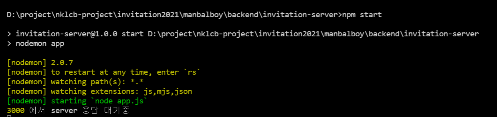
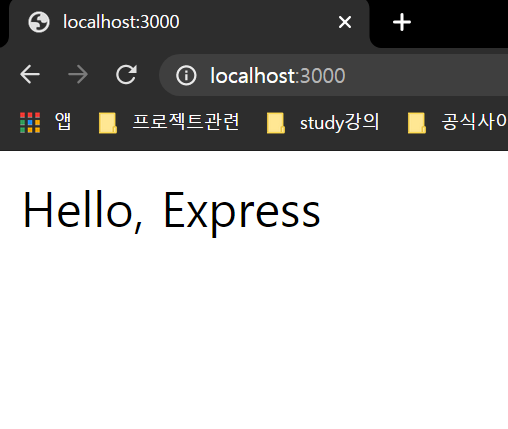

# [NODE] NODE.js의 express설치


## 1.개요
Node의 http 모듈을 사용하여 서버를 만들 수 있겠지만. 그 방법은 확장성이 떨어지고 새로운 기능을 구현하려면 많은 시간이 소요 된다. 

Node 에서는 많은 오픈소스들이 존재 하며 그중 가장 다운로드수가 많고 안정적이라고 평가받는 express 선택 하였고 설치하고 구동하는 법에 대해서 가이드를 한다.


## 2.express 설치 

먼저 폴더를 만든 후에 다음 명령어를 입력하여 node package.json 를 생성하여 node project 를 만든다. 

```bash
    $ npm init
```

package.json 이 생성되었으면 다음 명령어로 모듈을 설치한다. 

```bash
    $ npm i express
    $ npm i -D nodemon
```

위의 명령어로 2개의 패키지를 설치하였다.

 <b style="color:tomato">express</b>는 저희가 구현하고자 하는 node의 http 모듈을 감싸서 더욱 서버프로그래밍을 쉽게 도와주는 패키지이다. 

<b style="color:tomato">nodemon</b> 은 이 서버를 개발하고 구동함에 있어 편리한 기능들을 제공하는 패키지.


## 3.express 사용
2 챕터 에서 설치는 끝났습니다. 

설치가 완료 되었으면 사용을 해봐야 하니 간단한 예제 코드를 만들어 사용해 보자

```js
// file: "app.js"
const express = require('express');

const app = express();
app.set('port', process.env.PORT || 3000);

app.get('/', (req, res) => {
    res.send('Hello, Express');
});

app.listen(app.get('port'), () => {
    console.log(app.get('port'), '에서 server 응답 대기중');
});
```


보통 관습은 app.js 또는, index.js, server.js, main.js 로 root js 를 많이 사용하고 있는데 여기서는 app.js 로 파일을 작성하였다. 

package.json 파일에 nodemon script를 다음과 같이 설정

```json
// file: "package.json"

{
  "name": "invitation-server",
  "version": "1.0.0",
  "description": "",
  "main": "index.js",
  "scripts": {
    "test": "echo \"Error: no test specified\" && exit 1",
    "start" : "nodemon app"
  },
  "keywords": [],
  "author": "",
  "license": "ISC",
  "dependencies": {
    "express": "^4.17.1"
  },
  "devDependencies": {
    "nodemon": "^2.0.7"
  }
}
```
다음 명령어로 express server 를 구동. 

```bash
    $ npm start
```



커맨드 창에 위와 같은 명령어가 나왔다면 브라우저에 서버 url 을 입력하면 다음과 같은 화면 호출




## 4.정리
express 는 node의 http 모듈을 확장하여 제공하며 다른 서드파티 라이브러리들을 혼합하기에 좋은 구조로 개발되어있습니다. 

express 의 문법은 아래의 공식사이트를 참조하여 개발하시면 되겠습니다.  

> [express 공식](https://expressjs.com/)


