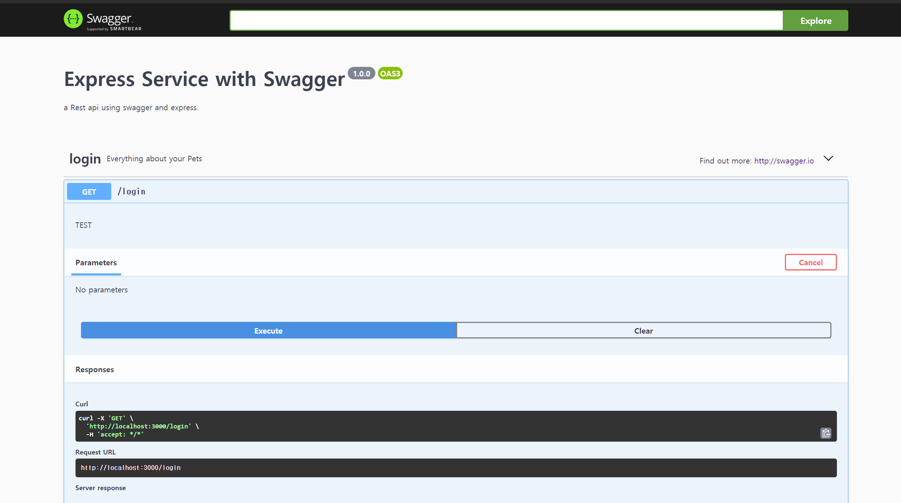

# [it] Swagger란?


## 1.개요
요세 IT 는 협업과 빠른 기술 변화로 인하여 정보전달의 효율성이 강조되고 있습니다. 

예전 방식의 개발방법론에서는 문서로 기술 스펙들을 ppt나 excel 에 작성하여 주고 받는 식으로 일을 해 왔었는데 이는 버전업이나. 관리하지 않으면 스펙이 바뀌었는데 문서가 최신화되지 않아 참고할 수 있는 방법이 없었습니다. 

swagger는 백엔드 프로그램과 프론트 프로그램 사이에서 정확히 어떤 방식으로 데이터를 구조화하여 주고 받을지에 대한 API 명세를 관리할 수 있는 도구로 요즘 개발에서는 많은 사이트들이 기술을 도입하고 있습니다. 

post 나 put , delete 같은 요청도 직접 테스트할 수 있기 때문에 postman , mockoon 같은 툴을 설치하지 않아도 해당 명세의 payload 만 안다면 테스트가 간편하기 때문에 rest 방식의 어플리케이션은 이 swagger를 도입하는 방법으로 생각하는게 좋을 것 같습니다.  


## 2.설치
Swagger는 국내의 웹어플리케이션 서버 비중 중 가장 큰 Spring에서도 사용가능 하고 Node 에서도 사용가능하다.

> [express 설치](https://manbalboy.github.io/javascript/express.html)

express 를 간단하게 설치한 후 다음 명령어를 입력하여 swagger 관련 모듈을 설치 합니다. 

```bash
 $ npm i swagger-ui-express swagger-jsdoc
```

Swagger ui 설정을 다음 과같이 작성합니다. 

```js

// file: "swagger.js"

module.exports = {
    swaggerDefinition: {
        openapi: "3.0.0",
        info: {
            title: "Express Service with Swagger",
            version: "1.0.0",
            description: "a Rest api using swagger and express.", // 스웨거 설명
        },
        host: "localhost:3000", // 스웨거 테스트 호스트
        basePath: "/", //스웨거 테스트 base end point 
        schemes: ["http"]
    },
    apis: ["./models/*.js", "./controllers/**/*.js"], // 스웨거 스펙 파일경로
};
```

위와 같이 config 파일을 만들었으면 app.js 에 swagger를 매핑 시켜 줍니다.

```js
// file: "app.js"
const swaggerUi = require("swagger-ui-express");
const swaggerJsdoc = require( "swagger-jsdoc");
const swaggerOptions = require( "./swagger");

// ...생략
// 스웨거 config 매핑
const specs = swaggerJsdoc(swaggerOptions);

//미들웨어 매핑 스웨거연동
this.app.use('/api-docs', swaggerUi.serve, swaggerUi.setup(specs, { explorer: true }));
```

이렇게 작성한 후 express를 구동하고 localhost:3000/api-docs 로 접근하면 다음과 같은 화면을 볼 수 있습니다.

{:.border}

스웨거는 schema 와 api 를 정의하고 살펴볼 수 있습니다. 

스펙 정의방법은 아래의 홈페이지를 참조하세요
> [스웨거 api spec 정의](https://editor.swagger.io/)

스웨거를 적용한 프로젝트는 다음 github를 참조하세요
> [express server](https://github.com/manbalboy/nklcb-project-invitation/tree/master/manbalboy/backend/invitation-server)

## 3.마무리
swagger는 현대 개발에서 MSA 환경에서 정말 도움이 많이 되는 도구이며 처음에 접근이 어려울 수 있으나 한번 익혀두면 계속 유용하게 사용할 수 있는 도구로써 학습가치가 충분히 있는것 같습니다. 