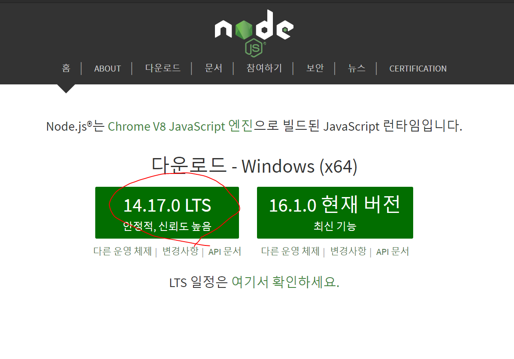
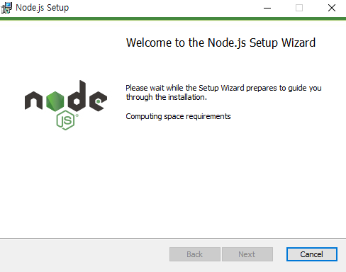
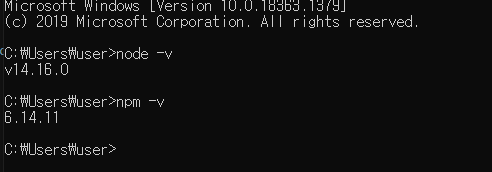
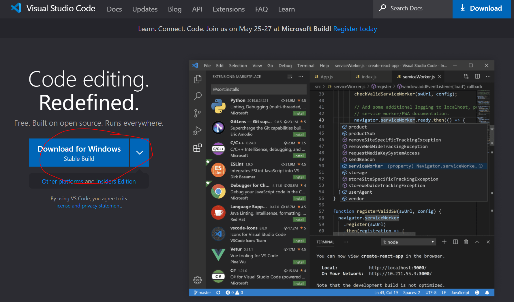
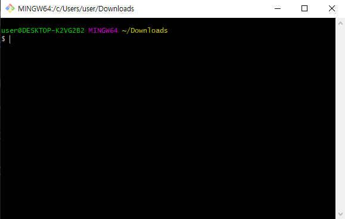
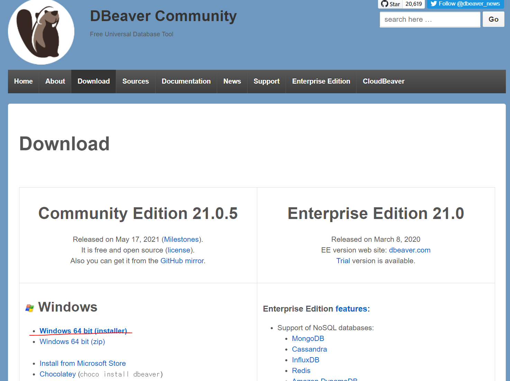

# 개발환경 Setting
## 1. Node.js 설치
1) [https://nodejs.org/ko/](https://nodejs.org/ko/) 접속후 14버전을 다운로드한다. 14버전이면 됨 하위 버전은 달라도 상관 없음.



2) 다운로드 받은 node를 실행하여 설치한다.


3) cmd 창에서 다음 명령어를 입력하여 설치가 완료 되었는지 확인한다.

```bash
    $> node -v
    $> npm -v
```


## 2.VSCode 설치 
1) [https://code.visualstudio.com/](https://code.visualstudio.com/) 접속하여 VSCode를 다운로드한다. 



2) 다운로드 한 파일을 실행하여 설치한다.


## 3.GIT 설치 
1) [https://git-scm.com/](https://git-scm.com/)접속하여 git을 설치한다.
![git]](./img/05.PNG)

2) 다운로드 한 파일을 실행하여 설치한다.

3) 마우스 우클릭 하여 Git Bash Here 를 클릭후 명령프롬프트를 활성화한다.


4) git config를 등록한다. (github아이디를 만들고 진행)
```bash
 $> git config user.name <github ID>
 $> git config user.email <github Email>
```


## DBeaver 설치
1) [https://dbeaver.io/download/](https://dbeaver.io/download/)에 접속하여 DBeaver를 다운로드한다. 



2) 다운로드 받은 파일을 설치한다.