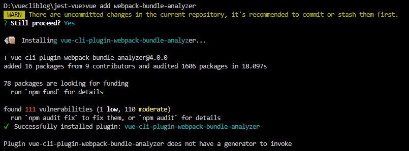
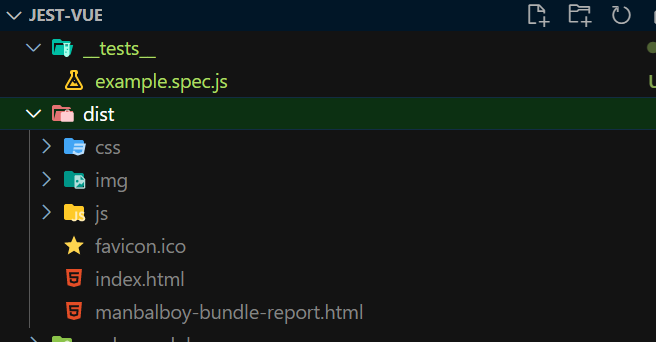
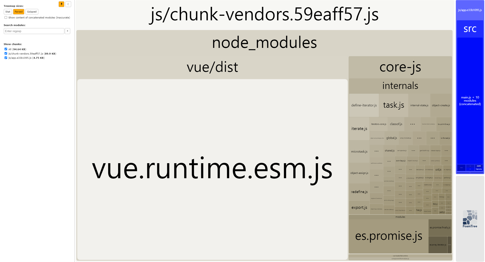

# [Vue] Vue webpack-bundle-analyzer


## 1. 개요
webpack-bundle-analyzer 는 웹팩 번들 파일의 구성요소를 시각화해서 나타내는 리포팅으로써 번들파일이 커지면 그 원인을 찾기에 꼭 필요한 도구입니다. 이 글에서는 Vue 프로젝트에 이 플러그인을 추가하고 사용하는 방법에 대해 학습하겠습니다. 


## 2. 설치 
이 글 에서는 vue-cli로 vue를 설치후 기본 프로젝트가 생성됬다는 가정하에 예제를 진행하겠습니다.

먼저 webpack-bundle-analyzer를 추가하는 방법은 아주 쉽습니다. 

vue cli 를 설치하셨으면 다음 명령어를 입력하세요 

```bash
 $ vue add webpack-bundle-analyzer
```

그러면 다음과 같이 설치가 되는 것을 확인 하실 수 있습니다. 



완료가 되었다면 설정을 해 보겠습니다. 

## 3. 설정
vue 의 설정은 cli 로 vue를 생성 하였다면 vue.config.js 파일에 웹팩관련 설정을 위임합니다.

vue.config.js 파일이 없다면 vue.config.js 파일을 생성후 아래의 코드를 입력해주세요.

```js
// file: "vue.config.js"

module.exports = {
  pluginOptions: {
    webpackBundleAnalyzer: {
      openAnalyzer: false, // 자동으로 open하지 않음
      analyzerMode: 'static' /* 분석파일 html 보고서를 dist 폴더에 저장한다  */,
      reportFilename: 'manbalboy-bundle-report.html', // 리포트이름
    },
  },
};
```

위와같이 설정 후 다음 명령어로 bulid를 해 봅니다. 

```bash
 $ npm run build
```

빌드가 완료 되었다면 dist 폴더안에 다음과 같은 파일들이 생겨난 것을 볼 수 있습니다. 




여기서 생성된 manbalboy-bundle-report.html 파일을 실행하면 다음과 같은 화면을 보실 수 있습니다. 



현재 프로젝트는 기본 프로젝트이기때문에 보여진 칸들이 별로 없지만 많은 컴포넌트들과 코드스플릿팅을 진행하다보면 무엇이 큰 파일인지 무엇이 적은 파일인지 알 수 있을 것 입니다. 
