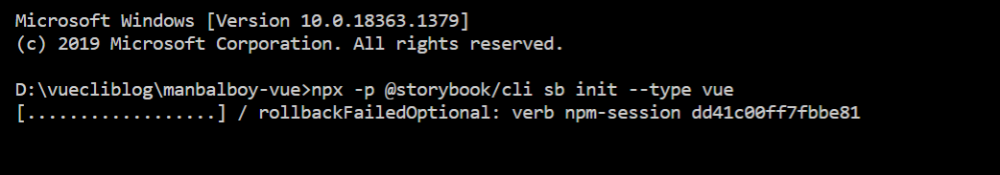
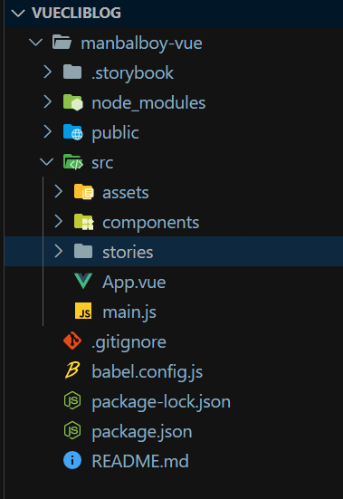
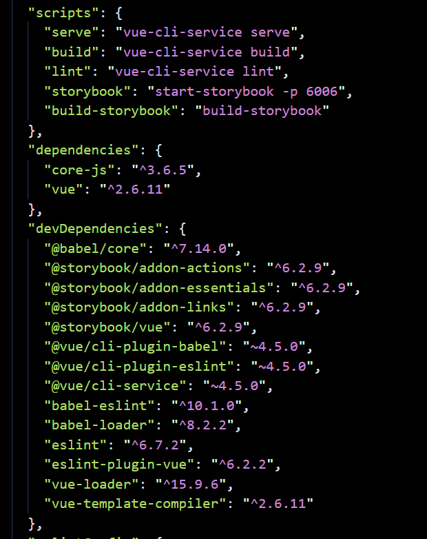
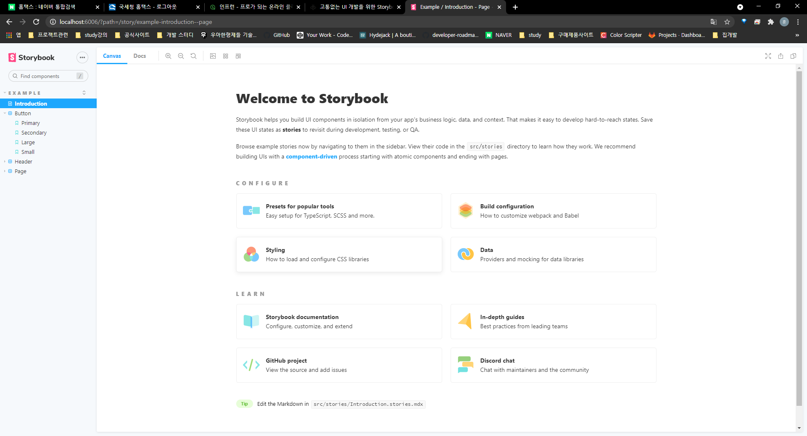

# [Vue] Vue project에 Storybook 설치


## 1. 개요
Storybook은 UI 개발 환경이며 동시에 UI 컴포넌트 플레이그라운드라고 할 수 있다.
컴포넌트를 관리하고 DOC을 제시해주며 디자인 시스템의 모체가 되기도 한다.

이 프로젝트에서 그렇기 때문에 Storybook을 도입할 것이며 Stroybook 을 통해서 component doc 을 대체해서 사용할 것이다.

## 2. 설치
Vue 프로젝트 터미널에서 다음 아래의 명령어를 입력합니다. 

```bash
 $ npx -p @storybook/cli sb init --type vue
```

명령어를 입력하면 설치가 진행됩니다. 



설치가 완료되면 root 경로에 .storybook 폴더와 src/stories 폴더가 생성되는 것을 보실 수 있습니다. 



이렇게 폴더가 생성되면 Package.json 을 살펴 볼까요?



scripts, devDependencies 에 storybook 관련 코드들이 추가 된 것을 보실 수 있습니다.

터미널에 다음 명령어를 입력합니다. 

```bash
$ npm run storybook
```

DevServer 가 로딩된후 localhost:6006 으로 접속하시면 storybook 이 구동 되는 것을 확인 할 수 있습니다.




